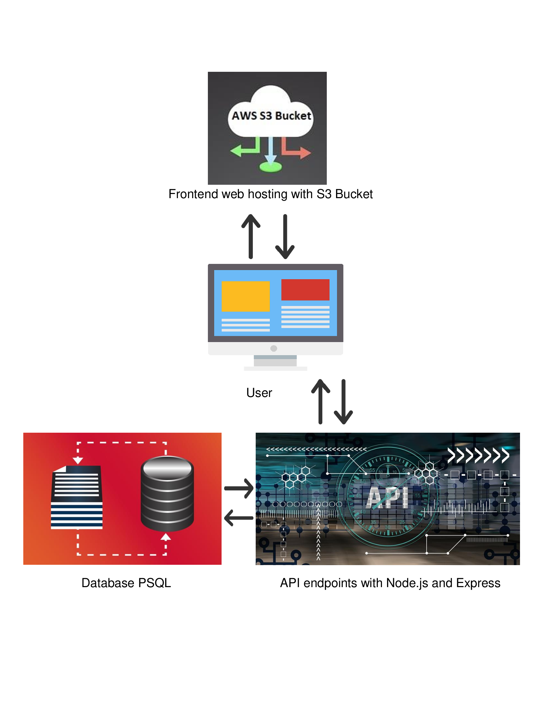

# Infrastructure description

A fullstack application that allows users to create new feeds from the frontend as well as authentication and authorization from the backend.

## Amazon Web Services components:
    - AWS Relational Database Service for storing user accounts and feeds
    - AWS Simple Storage Service Bucket for web hosting
    - AWS Elastic Beanstalk for API    

## AWS References:
    https://aws.amazon.com/rds/>
    https://aws.amazon.com/s3/
    https://aws.amazon.com/elasticbeanstalk/
